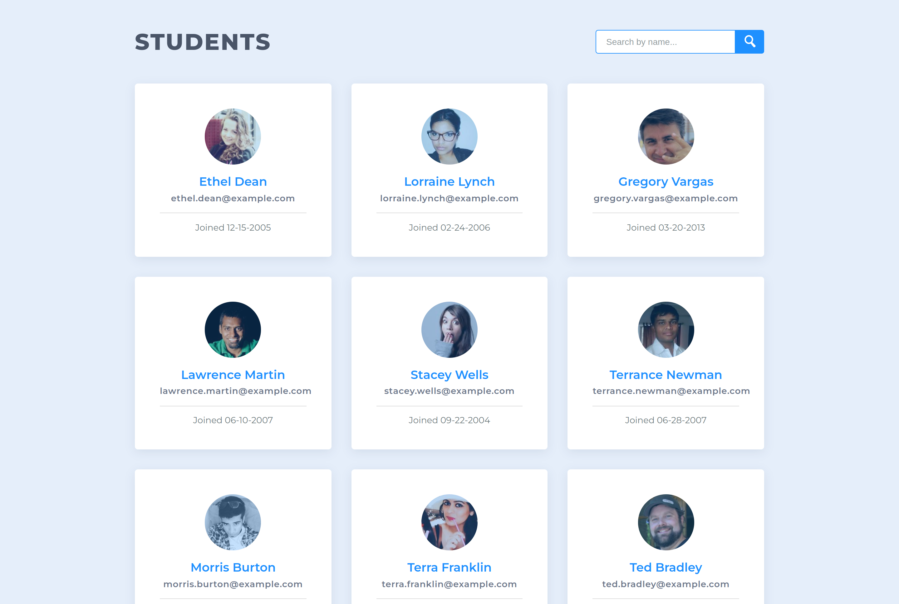

# FSJS - Data Pagination and Filtering

This is my project 2 solution in the Treehouse FSJS techdegree. Below is a list of features added on top of the project requirements.

| Extra features            | Description                                                 |
| :------------------------ | :---------------------------------------------------------- |
| Random user API           | Fetch student info from an API instead of using the data.js |
| Hightlight search matches | Style the name parts matching the search input              |
| Animate content           | Add many clip-path animations and transitions               |

Preview: 

Live URL: [Solution](https://kalrog-dev.github.io/fsjs_data_pagination_and_filtering/)